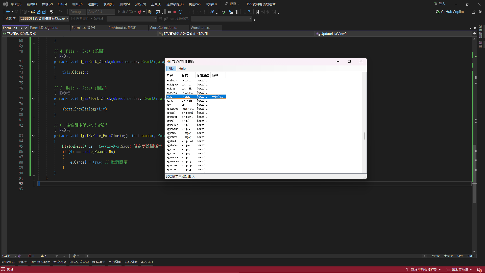

# 📄 單字卡與 TSV 資料檔讀取程式 (Word Flashcards & TSV Parser)

> 視窗程式設計 (II) - 檔案 I/O、自訂類別集合與多媒體整合
> 具備自訂資料模型 (Data Model)、強型別集合、多媒體語音播放及動態編輯功能的單字卡學習工具。

## 📝 專案概述
本專案打破傳統將資料與 UI 綁定的寫法，全面導入**物件導向 (OOP)** 設計思維。透過建構獨立的單字資料實體 (`WordItem`) 與自訂集合 (`WordCollection`)，實作從實體檔案讀取、字串解析到 `ListView` 動態渲染的完整資料流。同時整合了 COM 元件進行語音播放，並支援自動播放與資料編輯回存，為一完整的桌面端應用程式。

## 🚀 核心技術與實作亮點

### 1. 結構化資料模型 (OOP Data Modeling)
* **單字實體化 (`WordItem`)**：封裝單字、音標、音檔路徑與解釋等屬性。在建構子中利用 `String.Split('\t')` 精準切割 TSV 欄位，並透過 `Environment.NewLine` 完美還原帶有換行符號的複雜解釋文本。
* **強型別集合 (`WordCollection`)**：繼承自 `Collection<WordItem>`，自訂 `LoadFromStringArray` 方法集中管理資料載入邏輯，並實作 `SaveToFile` 將記憶體中的集合資料依 TSV 格式回存至實體文字檔，提升程式碼的強健度與可維護性。

### 2. 檔案串流與編碼處理 (File I/O & Encoding)
* 整合 `OpenFileDialog` 提供圖形化檔案選擇，並設定嚴謹的副檔名過濾機制 (`.tsv`, `.txt`)。
* 呼叫 `File.ReadAllLines` 與 `StreamWriter` 搭配 `Encoding.UTF8` 進行底層資料讀寫，確保特殊音標符號 (`æ`, `ǝ` 等) 能被正確解析與顯示。

### 3. 多媒體整合與快捷互動 (Media & Interaction)
* **語音播放**：無縫整合 `Windows Media Player` (COM 元件)，讀取單字對應的 `.mp3` 路徑進行即時發音。
* **自動播放機制**：結合 `Timer` 控制項 (`timPlayer`)，實作自動輪播單字的功能，並能動態計算 `ListView` 行高，讓焦點永遠保持在視窗中央。
* **鍵盤事件監聽**：開啟 `KeyPreview`，實作按下 `Enter` 播放下一個單字、按下 `Space` 重複播放的快捷操作。

### 4. 高效能 UI 渲染與視窗控制
* **ListView 動態綁定**：在迭代渲染數百筆單字資料時，嚴格執行 `BeginUpdate()` 與 `EndUpdate()`，凍結畫面重繪以極大化載入效能。
* **即時編輯 (`frmEditWord`)**：實作滑鼠雙擊 (`DoubleClick`) 事件，呼叫獨立的編輯表單，修改完畢後透過 `DialogResult` 同步更新主畫面與本地檔案。
* **狀態監聽與防呆**：利用 `StatusStrip` 即時回饋資料載入數量與錯誤訊息。實作 `FormClosing` 事件攔截視窗關閉動作，避免使用者誤觸流失工作狀態。

## 💻 執行畫面
*(請將專案執行截圖命名為 screenshot.png 並放置於本目錄)*

## ⚙️ 開發環境
* **IDE**: Visual Studio 2022
* **Framework**: .NET Framework 4.8
* **Language**: C#
